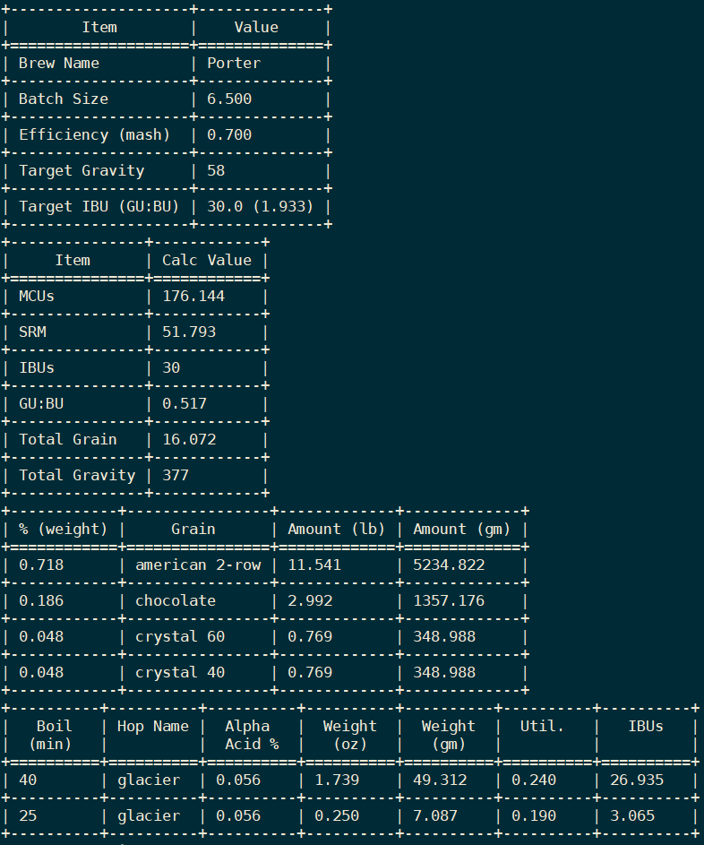

Description
===========

This is a simple python recipe creator for homebrew beer.

- `argparse` used for command-line configuration
- `configparser` used for ini-style recipe input
- `texttable` used for stdout formatting

Usage
=====

```sh
usage: recipator.py [-h] [-s] [-l] filename

positional arguments:
  filename             The conf file containing the desired recipe attributes

optional arguments:
  -h, --help           show this help message and exit
  -s, --shopping-list  Print out a list of ingredients and weights needed, default off
  -l, --less           remove 'top matter' if you want just the shopping list
```

Sample Recipe
=============

See `porter.conf` for some comments

```ini
[General]
Brew Name       : Porter
Batch Size      : 6.5
Mash Efficiency : 0.70
Target Gravity  : 58.0
Target IBU      : 30.0

[Grain Bill]
American 2-Row : 0.75, 35, 1.8
Crystal 60     : 0.05, 35, 60
Crystal 40     : 0.05, 35, 40
Chocolate      : 0.15, 27, 350

[Bittering Hops]
Glacier - 40 : 0.056, 0.24, 1.000

[Aroma Hops]
Glacier - 25: 0.25, 0.056, 0.19
```

Sample Output
=============

This is shown in the screenshot up top.
